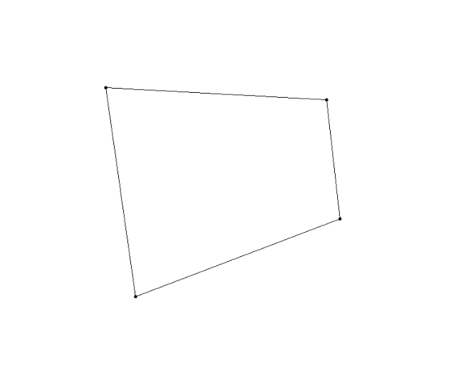
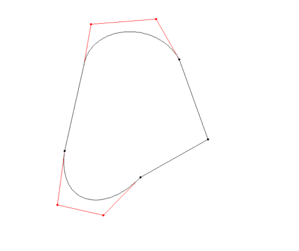
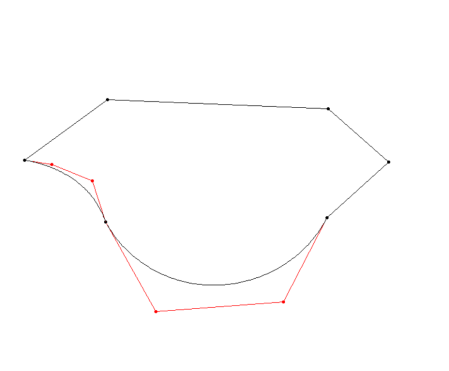

How to Run the Program

 • Open a terminal and navigate to the directory where your main.py
 file is located. • Execute the following command to start your
 program:

 *python* *main.py*

 • The program will prompt you to choose a mode by entering a number.
 Enter 0 for file reading mode or 1 for interactive mode.

 • **Directory** **Mode:**

 o If you choose this mode, the program will ask for the folder name in
 which 3 files will be stored or any number of files can be there.

 o Program will make sure to check folder existence and .txt file
 existence within it. o Then it will visualize all the polygons present
 in that file.

 o After visualization, program will ask for repeating this mode.

 • **File** **Reading** **Mode:**

 o If you chose File Reading Mode, the program will ask for the
 filename. Enter the filename with the extension (e.g.,
 **input_file.txt**).

 o The program will check if the file exists. If it does, it will draw
 the vertices and prompt you for transformations.

 o After transformations, the program will ask if you want to visualize
 the transformed vertices.

 o Finally, the program will ask if you want to save the transformed
 vertices to a file. o If you choose \"yes,\" the program will prompt
 you for the output filename.

 • **Interactive** **Mode**:

 o If you chose Interactive Mode, the program will guide you through
 selecting coordinates based on mouse clicks.

 o After selecting coordinates, the program will proceed with the
 transformations.

 o It will then ask if you want to visualize the transformed vertices
 and if you want to save them to a file.

 • Regardless of the mode chosen, the program may offer an option to
 generate a random polygon pattern.

 • If you choose \"yes,\" the program will generate a polygon and ask
 if you want to visualize it through the grid.

 • If you choose \"yes, the program will draw the points on plane and
 ask for saving these vertices in a file.

 • If you choose \"yes,\" the program will prompt you for the output
 filename. • After saving the data points, program will close
 automatically.

 • **Exit** **Operation:**

 o User can exit any time by typing exit in input dialogue box.

Program Capabilities

**Input** **Capabilities:**

 1\. **File** **Reading** **Mode:**

 • Users can provide input data by reading from a file.

 • The program prompts the user to enter the filename for reading.

 2\. **Interactive** **Mode:**

 • Users can provide input interactively through mouse clicks.

 • The program guides the user to select coordinates by clicking on the
 screen.

 • Pressing \'q\' finishes the coordinate selection.

**Transformations:**

 3\. **Transformation** **Functionality:**

 • After input is provided (either from file or interactively), the
 program allows users to perform transformations on the vertices.

 • The transformations may include translation, rotation, scaling, etc.

**Visualization:**

 4\. **Visualization** **of** **Vertices:**

 • After performing transformations, the program offers the option to
 visualize the transformed vertices.

 • Users can see the updated positions of vertices on the screen.

**File** **Output** **Capabilities:**

 5\. **Save** **Transformed** **Vertices** **to** **File:**

 • Users have the option to save the transformed vertices to a file
 after performing transformations.

 • The program prompts users to enter the filename for saving the
 transformed vertices.

 6\. **Save** **Generated** **Polygon** **to** **File:**

 • If the user chooses to generate a random polygon pattern, there is
 an option to save the generated polygon to a file.

 • The program prompts users to enter the filename for saving the
 generated polygon.

**Random** **Polygon** **Pattern** **Generation:**

 7\. **Random** **Polygon** **Pattern** **Generation:**

 • The program may offer the option to generate a random polygon
 pattern.

 • Users can choose to generate a random polygon with a specified
 number of vertices.

**User** **Interaction:**

 8\. **Interactive** **Menu:**

 • The program presents an interactive menu for users to choose between
 file reading mode and interactive mode.

 • Users can navigate through the program using numerical inputs to
 select different functionalities.

**Miscellaneous:**

 9\. **Error** **Handling:**

 • The program checks for the existence of the specified input file and
 provides appropriate messages if the file is not found.

 • Error handling for invalid inputs during file reading or interactive
 mode.

 10\. **Program** **Continuity:**

 • The program allows users to perform multiple operations in sequence
 or exit the program after completing the desired tasks.

These capabilities provide users with flexibility in providing input,
transforming data, visualizing results, and saving outputs, making the
program versatile and user-friendly.

Data Structure for Vertices

The data structure used to store the vertices is a list of tuples. Each
tuple in the list represents a vertex and its associated information.
Let\'s break down the structure:

vertices = \[

 (1, (x1, y1)), \# Vertex 1 with coordinates (x1, y1)

 (2, (x2, y2)), \# Vertex 2 with coordinates (x2, y2)

 \# \... more vertices \...

\]

Here, **vertices** is the list containing tuples. Each tuple has two
elements:

 1\. **Vertex** **Number:** The first element of the tuple represents
 the vertex number. It\'s an integer indicating the order or identity
 of the vertex in the polygon or curve.

 2\. **Coordinates:** The second element is a tuple containing the
 coordinates (x, y) of the vertex or control point associated with that
 vertex number.

So, for example, if you have a list like:

vertices = \[

 (1, (10, 20)),

 (2, (30, 40)),

 (3, (50, 60)),

\]

It represents a polygon or curve with three vertices. Vertex 1 is at
coordinates (10, 20), Vertex 2 is at (30, 40), and Vertex 3 is at (50,
60).

For cubic Bezier curves, you might have additional information for
control points:

vertices = \[

 (1, (x1, y1)), \# Vertex 1 with coordinates (x1, y1)

 (2, (x2, y2)), \# Vertex 2 with coordinates (x2, y2)

 (3, (x3, y3, (cx1, cy1), (cx2, cy2))), \# Vertex 3 with coordinates
 (x3, y3) and control points

\]

In this case, Vertex 3 has coordinates (x3, y3) and two control points
specified in tuples (cx1, cy1) and (cx2, cy2) and the curved edge is
between Vertex 2 and Vertex 3

Hence, for last curve to be a Bezier curve, control points will be in
Vertex 0.

Data File Format

Each line represents a vertex and the associated edges, and it follows
this general structure:

***vertex*** ***number:(x,*** ***y):***
***(cubic_bezier_control_point1)*** ***\|***
***(cubic_bezier_control_point2)\|***

 • **vertex** **number:** The unique identifier or index assigned to
 the vertex. It helps in referencing the vertex in the context of edges
 and the overall shape.

 • **(x,** **y):** The coordinates of the vertex, denoted as (x, y),
 representing its position in a two-dimensional space.

 • **\[cubic_bezier_control_point1\]:** If the edge associated with
 this vertex is a cubic Bezier curve, this part provides the
 coordinates of the first control point. Cubic Bezier curves are
 defined by two control points, and this is the first one.

 • **\[cubic_bezier_control_point2**\]: Similarly, if the edge is a
 cubic Bezier curve, this part provides the coordinates of the second
 control point, which is the second control point for defining the
 cubic Bezier curve.

Now, let\'s take an example line from your provided data:

**1:(-209.0,** **160.0)** **\|** **(-289.0,** **-89.0)** **\|**
**(-343.0,** **51.0)** **\|**

 • Vertex 1 is defined at coordinates (-209.0, 160.0).

 • There is an edge from vertex 0, and it\'s a cubic Bezier curve
 because there are two sets of control points in the final vertex.

 • The first control point is at (-289.0, -89.0).

 • The second control point is at (-343.0, 51.0).

Similarly, each line in data file represents a vertex, its coordinates,
and optionally the control points if the associated edge is a cubic
Bezier curve. This format is useful for representing complex shapes and
paths in a concise and structured way.

Key Strengths

 1\. **User-Friendly** **Input:**

 • The program allows the user to interactively input the number of
 vertices and select the vertices or control points using mouse clicks
 on the Turtle graphics window. This provides a user-friendly and
 intuitive way to specify the shape.

 2\. **Versatility:**

 • The program is versatile and can handle both straight edges
 (polygons) and curved edges (cubic Bezier curves) or mix of both. The
 user has the flexibility to choose the type of edge to draw.

 3\. **Real-time** **Visualization:**

 • The Turtle graphics library provides real-time visualization,
 allowing the user to see the shape being drawn step by step. This can
 be helpful for understanding the construction of polygons and curves.

 4\. **Modularity:**

 • The program is modular, with separate functions for drawing straight
 lines, cubic Bezier curves, and handling user input. This makes the
 code organized and easier to maintain or extend.

 5\. **Dynamic** **Control:**

 • The program dynamically updates the Turtle graphics window based on
 user input, creating an interactive experience. This dynamic control
 enhances user engagement.

Limitations

 1\. **Limited** **Error** **Handling:**

 • The program currently lacks robust error handling for various
 scenarios. For example, if the user enters invalid input or if there
 are issues with the mouse clicks, the program may not handle these
 situations gracefully.

 2\. **Visual** **Complexity:**

 • Drawing complex shapes with many vertices or control points might
 make the visualization cluttered. The program does not currently
 provide features like clearing the screen or selectively erasing
 specific elements.

 3\. **No** **Undo** **Feature:**

 • Once a shape is drawn, there is no undo feature. If the user makes a
 mistake or wants to modify a specific part of the shape, they need to
 restart the drawing process.

 4\. **Limited** **Interaction** **Information:**

 • The program could provide more informative messages or prompts
 during the drawing process to guide the user on the next steps. For
 instance, indicating the current step in the process.

 5\. **Dependency** **on** **Turtle** **Graphics:**

 • The program relies on the Turtle graphics library, which is
 primarily designed for educational purposes and may not be suitable
 for more advanced graphics applications.

 6\. **Limited** **Shape** **Editing:**

 •      The program does not offer features for editing or modifying
 shapes after they are drawn. This limitation could be a drawback for
 users who want to refine or adjust their drawings.

Some Patterns

 • Red dots and lines indicate control points and the path to them.

 {width="2.829861111111111in"
 height="2.374860017497813in"}{width="2.4465266841644793in"
 height="2.051804461942257in"}{width="2.249721128608924in"
 height="1.8569433508311461in"}• Black curves indicate the either a
 straight edge or curved Bezier made from two red dots i.e., control
 point 1 and control point 2.
